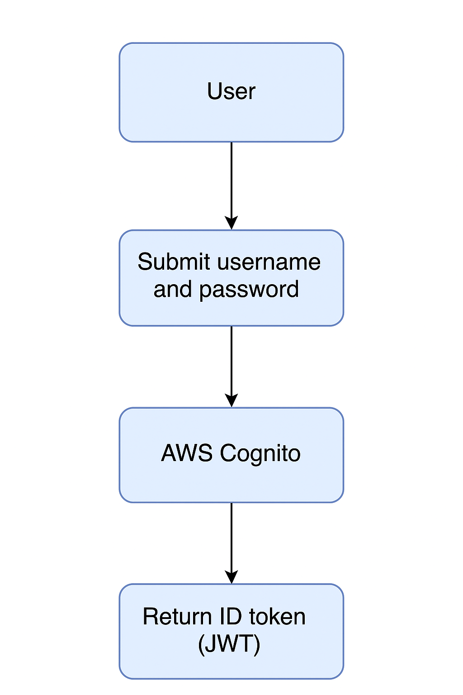

# AWS Cognito

AWS Cognito is a service that provides authentication, authorization, and user management for web and mobile applications. It allows developers to add user sign-up, sign-in, and access control to their applications easily.

#### Features

- User Sign-Up and Sign-In: AWS Cognito provides built-in user sign-up and sign-in functionality, allowing users to create accounts and log in securely.
- User Pools: AWS Cognito User Pools are user directories that provide sign-up and sign-in options for your app users. You can create a user pool to manage your users and their attributes.
- Identity Pools: AWS Cognito Identity Pools enable you to create unique identities for users and authenticate them with identity providers, such as Facebook, Google, or Amazon.
- Federated Identities: AWS Cognito allows you to authenticate users through social identity providers (like Facebook and Google) or SAML-based identity providers.
- Multi-Factor Authentication (MFA): AWS Cognito supports MFA to enhance security by requiring users to provide additional verification (e.g., SMS or TOTP) during sign-in.
- User Management: AWS Cognito provides APIs for managing users, including creating, updating, and deleting user accounts.
- Custom Attributes: You can define custom attributes for users in your user pool to store additional information.
- User Groups: AWS Cognito allows you to create user groups to manage permissions and access control for different sets of users.
- Triggers: AWS Cognito provides triggers that allow you to run custom code in response to specific events, such as user sign-up or sign-in.
- Security: AWS Cognito provides built-in security features, including encryption of data at rest and in transit, to protect user information.
- Integration with AWS Services: AWS Cognito integrates seamlessly with other AWS services, such as AWS Lambda, Amazon API Gateway, and Amazon S3, to build serverless applications.

#### Getting Started

- [AWS Cognito Documentation](https://docs.aws.amazon.com/cognito/latest/developerguide/what-is-amazon-cognito.html)
- [AWS Cognito User Pools](https://docs.aws.amazon.com/cognito/latest/developerguide/user-pools.html)
- [AWS Cognito Identity Pools](https://docs.aws.amazon.com/cognito/latest/developerguide/identity-pools.html)
- [AWS Cognito SDK for Java](https://docs.aws.amazon.com/sdk-for-java/latest/developer-guide/home.html)

#### Installation

Rename the .env.sample file to .env and fill in the required values.

### Author

- **Raul Bolivar Navas** - [rasysbox](https://github.com/raulrobinson/cqrs-clean-architecture-mapstruct-jpa)

### License

This project is licensed under the MIT License - see the [LICENSE](https://www.apache.org/licenses/LICENSE-2.0) file for details.

